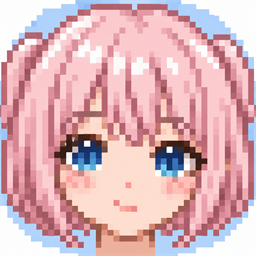

<h1>&nbsp;Sodalite</h1>

日本語 | [English](README.en.md)

Stable Diffusion 画像生成デスクトップアプリ。一から独自実装したもの。


## 主な機能

- **text-to-image**: プロンプトから新しい画像を生成
- **image-to-image**: 元画像を選択してプロンプトに沿って画像を変換。入力は中央を正方形にトリミングして `1024×1024` で処理し、変化の強さで元画像をどの程度維持するか調整可能
- **プロンプト強調**: `(語句)`、`(語句:1.3)`、`[語句]` による語句単位の強調・弱調に対応
- **生成設定**: サンプラー、シード、ステップ数、CFG スケール、解像度、バッチ枚数を指定
- **LoRA**: 複数の LoRA を選択し、各ウェイトを指定して適用
- **生成履歴**: 出力 PNG のメタデータを保持し、ギャラリーで閲覧・パラメータ再利用・保存・コピーが可能
- **GPU 自動選択**: CUDA、Windows 版 ROCm (対応 Radeon)、DirectML、CPU の順で利用可能な実行環境を選択
- **llama.cpp チャット連携**: OpenAI互換 API のローカル llama.cpp server と会話し、ツール呼び出しでプロンプト・ネガティブプロンプトを自動更新。更新前の状態へ戻すことも可能

- **フロントエンド**: WinUI3 (.NET 9 / Windows App SDK)
- **バックエンド**: Python 3.12 / FastAPI / diffusers (uv管理)
- **通信方式**: フロントエンドがバックエンドをローカルサブプロセスとして起動し、HTTP経由で通信する
- **ブラウザ webui**: WinUI3 を使わず、バックエンド単体をブラウザ用 UI 付きで起動できる (LAN内の他デバイスからアクセス可能。[後述](#ブラウザ-webui-lanアクセス))
- セーフティチェッカーは無効化しており、🔞NSFW 画像の生成も可能。生成物の利用・公開は各自の責任・使用モデルのライセンス・居住地の法令に従うこと。

## ダウンロードとインストール

- GPU: VRAM 12 GiB 以上が推奨です。(VRAM 10 GiB でも一応動作します)
- `uv` コマンドの Windows 版インストールが必要です。  
  https://docs.astral.sh/uv/#installation

- [Releases](https://github.com/Himeyama/Sodalite/releases) から、最新版の EXE ファイルをダウンロードしてください。  
  個人開発アプリのためブラウザで一時ブロックされますが、「⋯」→「保存」→「削除」ボタンの「∨」→「保持する」から保存可能です。

  

  セキュリティー上、インストーラーは [Actions](https://github.com/Himeyama/Sodalite/actions) から自動作成してます。

## ディレクトリ構成

```
Sodalite/
├── backend/           # Pythonバックエンド (uv管理, FastAPI + diffusers)
│   ├── src/sodalite_backend/
│   │   ├── main.py            # FastAPIエントリポイント
│   │   ├── config.py          # 起動設定(ポート・モデルID)
│   │   ├── api/                # REST APIエンドポイント
│   │   ├── schemas/            # Pydanticリクエスト/レスポンスモデル
│   │   ├── inference/           # diffusersパイプライン管理・サンプラー
│   │   ├── imaging/            # PNGメタデータ埋め込み・画像保存
│   │   └── webui/              # ブラウザ用UI (HTML/JS/CSS, 静的配信)
│   └── tests/
├── frontend/Sodalite/    # WinUI3フロントエンド
│   ├── MainWindow.xaml(.cs)    # バックエンド起動・ナビゲーション
│   ├── Views/GenerationPage    # プロンプト入力・生成・画像表示
│   ├── ViewModels/              # GenerationViewModel
│   └── Services/                # BackendProcessManager, BackendApiClient
├── docs/               # セットアップ記録等のドキュメント
├── skills/             # 開発規約 (winui3-app, python-coding)
├── run.ps1             # アプリ起動スクリプト(ルート)
├── run-webui.ps1       # ブラウザ webui 起動スクリプト(LANアクセス)
└── CLAUDE.md
```

## セットアップ

### 前提条件

- Windows 10 22H2以降 / Windows 11
- .NET 9 SDK
- Python 3.12 と [uv](https://docs.astral.sh/uv/)
- NVIDIA GPU (CUDA対応) または AMD Radeon GPU。Windows版ROCm 7.2.1対応RadeonではROCmを使用し、それ以外のDirectX 12対応RadeonではDirectMLへフォールバックする。VRAM 8GB以上推奨。CPUのみでも動作するが低速

### 初回セットアップ

```powershell
# バックエンドの依存関係インストール
cd backend
uv sync
```

初回起動時、バックエンドが Hugging Face から画像生成モデル(既定: `stabilityai/sd-turbo`)を自動ダウンロードする。

### Krea 2 Turbo

モデルフォルダーに `krea2Turbo_v10_bf16.safetensors` などの Krea 2 Turbo 重みを置き、モデル画面から選択する。ComfyUI 形式の scaled FP8 重みも読み込めるが、実行時には BF16 に復元するため、生成時のメモリ使用量や速度は BF16 版とほぼ同じになる。初回選択時には、画像生成に必要な `Qwen/Qwen3-VL-4B-Instruct` テキストエンコーダーと `Qwen/Qwen-Image` VAE が Hugging Face からダウンロードされる。重みファイルは元の場所から読み込み、複製しない。

Turbo の推奨設定は 8 ステップ、CFG 0、Euler、1024×1024。モデル選択時に画面の値が自動設定される。Krea 2 Turbo はテキストからの画像生成に対応し、画像からの生成は使用できない。BF16 の大きなモデルなので、GPU ではテキストエンコーダー・生成器・VAE を順に CPU と GPU 間で入れ替えて実行する。

### 起動

```powershell
# ルートで実行: バックエンド同期 + フロントエンドビルド + 起動を一括で行う
./run.ps1
```

アプリを起動すると、WinUI3プロセスが自動的にPythonバックエンドを子プロセスとして起動する(空きポートを動的に検出し、ヘルスチェック完了まで待機)。アプリを閉じるとバックエンドの子プロセスも確実に終了する。

### llama.cpp チャット連携

任意で、[llama.cpp](https://github.com/ggml-org/llama.cpp) の OpenAI 互換サーバーを既定ポート `8080` で起動すると、画像生成画面の右下に「チャット/モデル名」が表示される。

```powershell
# llama.cpp の配置先で実行する例
./llama-server.exe -m <モデルファイル.gguf> --port 8080
```

アプリは起動時と以後10秒ごとに `http://127.0.0.1:8080/v1/models` を確認する。3秒以内に応答しない、またはモデル一覧を取得できない場合はチャットを表示しない。起動を検出するとモデルを選択でき、チャットは生成設定の左側に開く。

チャットAIには現在のプロンプトとネガティブプロンプトが渡される。AIが専用ツールを呼び出した場合のみ入力欄を自動更新し、各プロンプト見出しの戻すボタンから更新直前の状態を復元できる。会話履歴はアプリ終了時またはチャットのリセット操作で消去される。

### バックエンド単体での動作確認

```powershell
cd backend
./run.ps1
# 別ターミナルで
curl http://localhost:8000/api/v1/health
```

## ブラウザ webui (LANアクセス)

WinUI3 アプリを使わず、バックエンド単体をブラウザ用 UI 付きで起動できる。API と UI を
同一プロセス (同一オリジン) で配信するため、**同一LAN内のスマホ・タブレット・別PCの
ブラウザから画像生成を操作できる**。

```powershell
# ルートで実行 (uv sync + 0.0.0.0 バインドで起動)
./run-webui.ps1
# ポートを変える場合
./run-webui.ps1 -Port 9000
```

起動するとコンソールにアクセスURL (このPC用 `http://127.0.0.1:8188/` と
LAN用 `http://<このPCのIP>:8188/`) が表示される。他デバイスのブラウザでLAN用URLを開く。

> [!WARNING]
> webui は **無認証** で `0.0.0.0` にバインドされ、同一LAN内の誰でもアクセスできる。
> **信頼できるネットワークでのみ使用すること。** インターネットに直接公開しないこと。
> 他デバイスから接続できない場合、Windows ファイアウォールで当該ポート (既定 8188) の
> 受信を許可する必要がある。

## 開発

### バージョニング

バージョンは `MAJOR.MINOR.PATCH` 形式で管理する。メジャーバージョンはユーザーが明示的に指定した場合のみ上げ、機能追加ではマイナーバージョンを、バグ修正のみではパッチバージョンを上げる。更新時は手動編集せず、ルートで次を実行する。

```powershell
./bump-version.ps1 -Version x.y.z
```

このスクリプトはすべてのバージョン定義と `backend/uv.lock` を一括更新する。

- Pythonバックエンドのコーディング規約: [`skills/python-coding/SKILL.md`](skills/python-coding/SKILL.md)
- WinUI3フロントエンドのコーディング規約: [`skills/winui3-app/SKILL.md`](skills/winui3-app/SKILL.md)

```powershell
# バックエンドのlint/format/test
cd backend
uv run ruff check --fix .
uv run ruff format .
uv run pytest

# フロントエンドのビルド
cd frontend/Sodalite
dotnet build -c Debug
```

## 配布 (インストーラー)

エンドユーザー向けに NSIS 製インストーラー (`Sodalite-Setup-<version>.exe`) を生成できる。

### 前提条件

- **ビルド側**: .NET 9 SDK, [NSIS](https://nsis.sourceforge.io/) (`makensis`)
- **エンドユーザー側**: [uv](https://docs.astral.sh/uv/) がインストール済みであること。
  Python 3.12 は uv が初回セットアップ時に自動取得するため、別途の Python インストールは不要。

### インストーラーのビルド

```powershell
# ルートで実行 (publish → backend ステージング → NSIS コンパイルを一括)
./installer/build-installer.ps1 -Version 1.0.0
# または
make installer
```

`installer/dist/Sodalite-Setup-<version>.exe` が生成される。

### インストール後の初回起動

インストーラーは `%LOCALAPPDATA%\Programs\Sodalite\` に `app\` (フロントエンド) と `backend\`
(Python ソース) を配置する(管理者権限不要のユーザーインストール)。`.venv` は同梱されず、
**初回起動時にフロントエンドが `uv sync` を実行**して仮想環境を作成・依存パッケージを
インストールする (torch 等で数GB、数分〜数十分)。

- セットアップの成否は `%LOCALAPPDATA%\Sodalite\.venv-ready` に依存関係のフィンガープリントとして記録される
  (アプリ自身のバージョンを除いた `uv.lock` のハッシュを保存)。成功した場合のみマーカーが書かれ、失敗した場合は
  **次回起動時に自動で再セットアップ**が走る。アプリ更新で依存が変わった場合も再同期される。
- uv が見つからない場合は、アプリ起動時に uv のインストールを促すメッセージが表示される。

## API概要

バックエンドは独自設計のREST API (`/api/v1/*`) を提供する。

| Method | Path | 説明 |
|---|---|---|
| GET | `/api/v1/health` | 起動確認・ロード中モデル・デバイス情報 |
| GET | `/api/v1/samplers` | 利用可能なサンプラー一覧 |
| POST | `/api/v1/generations/text-to-image` | txt2img生成 |
| POST | `/api/v1/generations/image-to-image` | 元画像とプロンプトによる img2img生成 |

詳細は `backend/src/sodalite_backend/api/` を参照。

## 免責事項

- 本アプリは画像生成モデルを実行するためのツールであり、生成された画像の内容・利用・公開について作者は一切の責任を負いません。生成物の利用はすべて利用者自身の責任で行ってください。
- 生成画像には、使用したモデルのライセンス(モデルカード記載の利用規約・禁止事項等)が適用されます。商用利用・再配布・NSFW 表現の可否等はモデルごとに異なるため、利用前に必ず使用モデルのライセンス条項をご確認ください。
- 生成画像がプロンプトや学習データ由来で既存の著作物・商標・肖像等の権利に類似・抵触する可能性があります。生成物を公開・配布・商用利用する際は、著作権・商標権・パブリシティ権等の第三者の権利を侵害しないよう利用者自身でご確認・ご判断ください。
- アニメ・ゲーム・映画等の既存キャラクターやその他 IP (知的財産) を模倣・想起させる画像の生成についても、著作権・商標権の侵害となる可能性があります。とくに当該 IP の権利者が許諾していない商用利用・二次配布・性的表現等は権利侵害・規約違反となるおそれがあるため、利用者自身の責任でご判断ください。
- 実在の人物を描写する画像(なりすまし、誹謗中傷、性的な文脈での無断使用等)の生成・利用は、利用者の居住地の法令やプラットフォームの規約に違反する場合があります。法令・規約の遵守は利用者の責任とします。
- 法令で規制される内容の生成・所持・頒布は固く禁止します。
